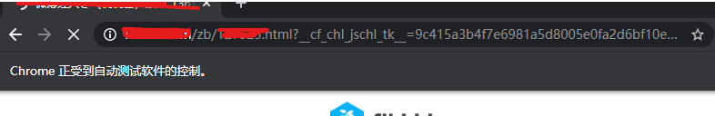
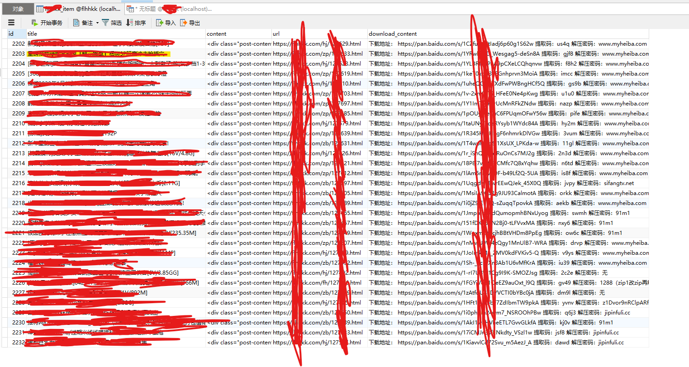

# Spiders
serveral spiders using requests, BeautifulSoup or scrapy, and so on.

Data crawled be stored in MongoDB or MySQL. Spider kongjie downloads pictures of all users in kongjie.com.

## [Spider haofl](haofl):

It crawls haofl.net using scrapy, extends CrawlSpider but in Spider style.

## [Spider kongjie](kongjie):

A spider using requests and BeautifulSoup to crawl kongjie.com. It is concise enough because of requests and bs4. Redis hash is used to de-duplicate person.

Blog is here: [Python网络爬虫requests、bs4爬取空姐网图片](https://blog.csdn.net/c315838651/article/details/72773602)

## [Spider qiubai](qiubai):

This spider crawls qiushibaike.com using scrapy. It extends CrawlSpider but in Spider style. Style such as Rule, LinkExtractor in CrawlSpider will be used soon. Data crawled is stored into MongoDB.

Blog is here: [Python爬虫框架Scrapy之爬取糗事百科大量段子数据](https://blog.csdn.net/c315838651/article/details/72675470)

## [Spider onesixnine](onesixnine):

A spider using scrapy which can crawl all images in 169ee.com. It use CrawlSpider in scrapy to crawl the full site. Rule and LinkExtractor are used to extract links to follow. Images will be saved in the disk.

Blog is here: [爬虫进阶：CrawlSpider爬取169ee全站美女图片](https://blog.csdn.net/c315838651/article/details/72791668)

## [Spider flhhkkSpider](flhhkkSpider):

A spider using scrapy and selenium to crawl all candidate baidu wangpan download links, then preserves them in MySQL. It use CrawlSpider in scrapy to crawl the full site.

### Running

### Data

Blog is here: TODO

You can give me a star if they help you.

Cite it when you use it to write any blog or post.

# Copyright

ychen@fdu
